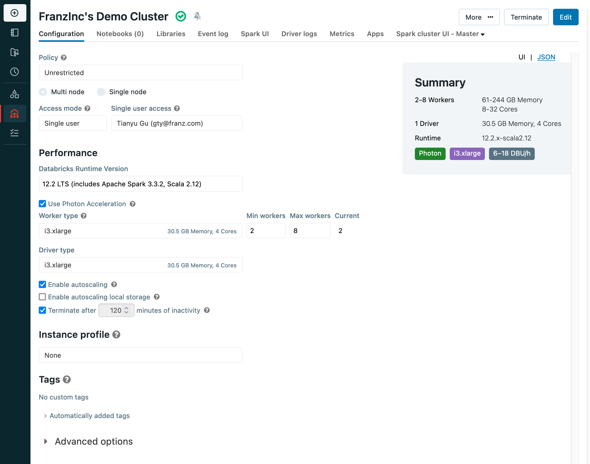
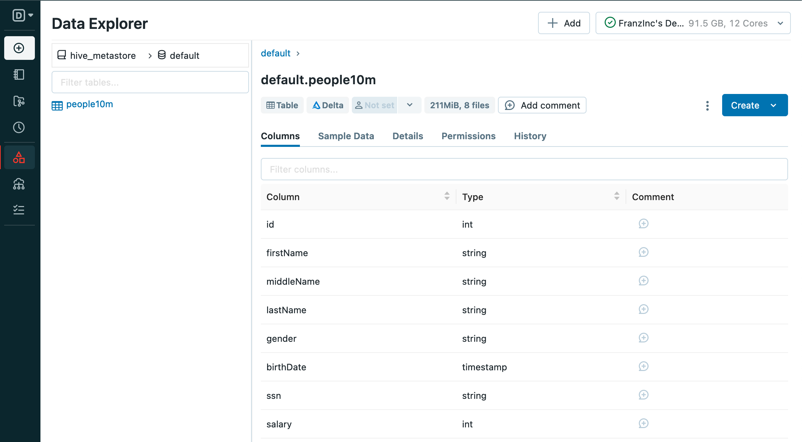
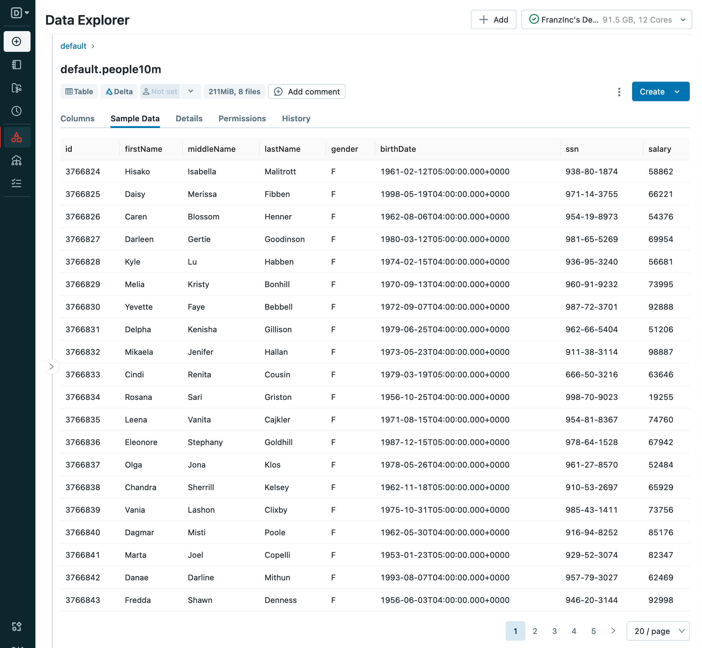
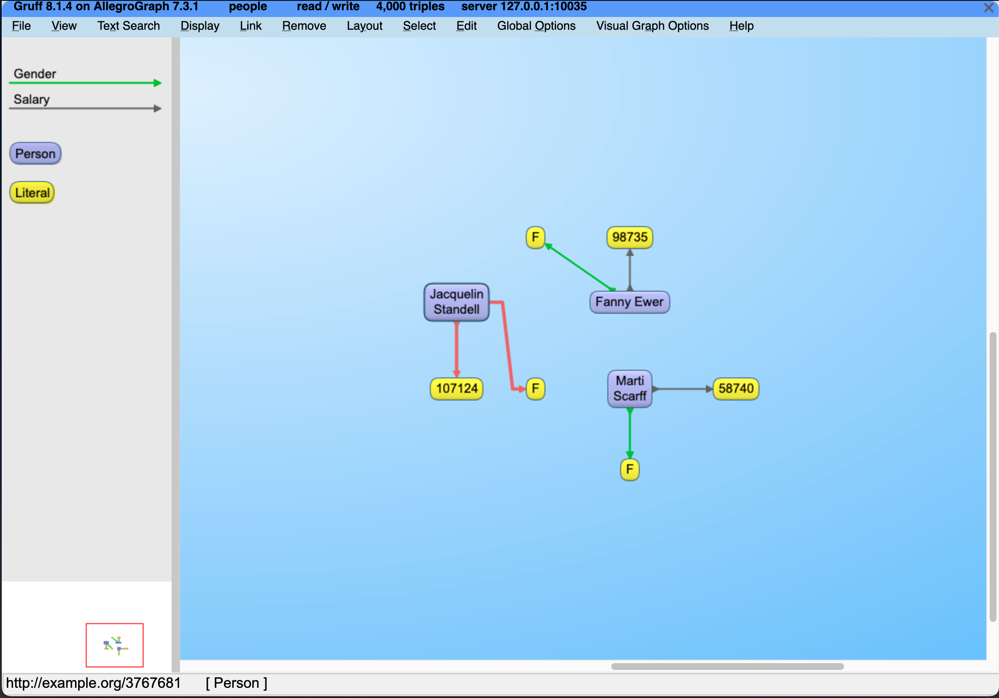

# Tutorial - AllegroGraph Semantic Layer for Databricks (Delta Lake)

[Databricks](https://www.databricks.com/) is a popular choice for hosting
[lakehouses](https://www.databricks.com/blog/2020/01/30/what-is-a-data-lakehouse.html) -
a new architecture that unifies data storage, analytics, and AI on one platform.
On the other hand, as an enterprise knowledge graph platform, AllegroGraph
provides quick semantic layer integration with Databricks transparently through
our advanced VKG (virtual knowledge graph) interface.

In this tutorial, we will show you how to load RDF triples directly from your
[Delta Tables](https://docs.databricks.com/delta/index.html) that are hosted in
Databricks, and we assume the readers have prior experience with AllegroGraph
and our
[agtool](https://franz.com/agraph/support/documentation/current/agtool.html)
facility.

For users starting with the open-source [Delta Lake](https://delta.io) but not
hosted on Databricks, this tutorial may still apply, as long as your platform
exposes a JDBC connection and enables SQL as (one of) its query interface.

## Requirements

Obviously, you will need to have a running
[cluster](https://docs.databricks.com/clusters/index.html) or a [SQL
warehouse](https://docs.databricks.com/sql/admin/create-sql-warehouse.html#what-is-a-sql-warehouse)
in your Databricks workspace as well as an AllegroGraph server. This tutorial
uses a cluster to demonstrate.

Note that Databricks provides trial clusters and one can start from
[here](https://www.databricks.com/try-databricks?itm_data=NavBar-TryDatabricks-Trial#account).
If all is successfully set up, the cluster's dashboard should look similar to
this:



## Create a table and load a sample dataset

We use a sample dataset called _people10m_ for this tutorial. As
[documented](https://docs.databricks.com/dbfs/databricks-datasets.html#create-a-table-based-on-a-databricks-dataset)
by Databricks, we can load it into a table by executing this SQL query:

```sql
CREATE TABLE default.people10m OPTIONS (PATH 'dbfs:/databricks-datasets/learning-spark-v2/people/people-10m.delta')
```

After being successfully loaded, you can find the table in the Data Explorer:



as well as a few sample data rows:



## Prepare Databricks JDBC Connection

Now we need to prepare the Databricks JDBC connection details. You may follow
[these
steps](https://docs.databricks.com/integrations/jdbc-odbc-bi.html#get-connection-details-for-a-cluster)
to retrieve the JDBC URL, which may look similar to:

```
jdbc:databricks://dbc-0bf1f204-2226.cloud.databricks.com:443/default;transportMode=http;ssl=1;httpPath=sql/protocolv1/o/3267754737859861/0405-070225-tumf7a9c;AuthMech=3;UID=token;PWD=<personal-access-token>
```

A personal access token is needed, see
[here](https://docs.databricks.com/dev-tools/api/latest/authentication.html#generate-a-personal-access-token)
for how to generate one.

Last but not least, we will need to download the Databricks JDBC driver from
[here](https://www.databricks.com/spark/jdbc-drivers-download). This tutorial
uses [version
2.6.32](https://databricks-bi-artifacts.s3.us-east-2.amazonaws.com/simbaspark-drivers/jdbc/2.6.32/docs/release-notes.txt).
Both the URL and the driver are needed by AllegroGraph's virtual knowledge graph
interface, as we will see later.

## vload - Load RDF triples from Databricks

The
[vload](https://franz.com/agraph/support/documentation/current/vgraph-interface.html)
facility of
[agtool](https://franz.com/agraph/support/documentation/current/agtool.html) is
able to load data from relational databases as RDF triples. For a tutorial for
vload itself, please refer to this
[page](https://github.com/franzinc/agraph-examples/blob/master/ontop/README.md).

To configure vload, we need 2 files:

### demo.properties

This file contains information about the Databricks JDBC connection details as
what we have shown in the previous section:

```
jdbc.url=<your-JDBC-url>
jdbc.driver=com.databricks.client.jdbc.Driver
```

Note that the downloaded Databricks JDBC driver also needs to be properly
installed. See more details
[here](https://ontop-vkg.org/guide/cli.html#jdbc-configuration).

### demo.mapping.obda

This file defines the rules of how to map the columns from the people10m table
between our expected RDF triples. As the target and source sections indicate, we
will map `id`, `firstName`, `lastName`, `gender`, and `salary` into RDF triples
by executing a SQL query.

```
[PrefixDeclaration]
:           http://example.org/
rdf:		http://www.w3.org/1999/02/22-rdf-syntax-ns#
rdfs:		http://www.w3.org/2000/01/rdf-schema#
owl:		http://www.w3.org/2002/07/owl#
xsd:		http://www.w3.org/2001/XMLSchema#
obda:		https://w3id.org/obda/vocabulary#

[MappingDeclaration] @collection [[

mappingId	people10m
target      :{id} a :Person ; rdfs:label "{firstName} {lastName}" ; :gender "{gender}"; :salary "{salary}"^^xsd:int .
source		SELECT * FROM `hive_metastore`.`default`.`people10m` LIMIT 1000

]]
```

By using this mapping, a row of such data:

| id      | firstName | middleName | lastName  | gender | birthDate                    | ssn         | salary |
|---------|-----------|------------|-----------|--------|------------------------------|-------------|--------|
| 3766824 | Hisako    | Isabella   | Malitrott | F      | 1961-02-12T05:00:00.000+0000 | 938-80-1874 | 58863  |

will be mapped to these RDF triples (in Turtle syntax):

```turtle
@prefix :      <http://example.org/> .
@prefix rdf:   <http://www.w3.org/1999/02/22-rdf-syntax-ns#> .
@prefix xsd:   <http://www.w3.org/2001/XMLSchema#> .
@prefix rdfs:  <http://www.w3.org/2000/01/rdf-schema#> .

:3766824  a         :Person ;
        rdfs:label  "Hisako Malitrott" ;
        :gender     "F" ;
        :salary     "58863"^^xsd:int .
```

For more details on creating mappings, please refer to this
[page](https://github.com/franzinc/agraph-examples/blob/master/ontop/README.md#31-ontologies-and-mappings).

Finally, we can start vloading by running this command:

```shell
agtool vload --ontop-home /path/to/ontop --properties /path/to/your/demo.properties --mapping /path/to/your/demo.mapping.obda people

2023-04-12T19:04:13| Creating a temporary workspace
2023-04-12T19:04:13| Temporary workspace successfully created: "/tmp/agtool-vload-1dfd731d-4862-e844-fde6-0242164d5260/"
2023-04-12T19:04:13| Mapping file is given, skip bootstrapping
2023-04-12T19:04:13| Starting materialization
2023-04-12T19:04:16| Materialization - OBTAINED FROM SPARK JDBC DRIVER: hive_metastore, default
2023-04-12T19:04:18| Materialization - 19:04:18.398 |-INFO  in i.u.i.o.a.r.impl.QuestQueryProcessor - Ontop has completed the setup and it is ready for query answering!
2023-04-12T19:04:30| Materialization - WARNING: sun.reflect.Reflection.getCallerClass is not supported. This will impact performance.
2023-04-12T19:04:31| Materialization - NR of TRIPLES: 1000
2023-04-12T19:04:31| Materialization - Elapsed time to materialize: 13218 {ms}
2023-04-12T19:04:34| Materialization - NR of TRIPLES: 1000
2023-04-12T19:04:34| Materialization - Elapsed time to materialize: 2786 {ms}
2023-04-12T19:04:35| Materialization - NR of TRIPLES: 1000
2023-04-12T19:04:35| Materialization - Elapsed time to materialize: 1339 {ms}
2023-04-12T19:04:36| Materialization - NR of TRIPLES: 1000
2023-04-12T19:04:36| Materialization - Elapsed time to materialize: 1210 {ms}
2023-04-12T19:05:36| Materialization successfully exited
2023-04-12T19:05:36| Start loading triples
2023-04-12T19:05:37| Load finished 4 sources in 78ms (0.08 seconds).  Triples added:     	4,000, Average Rate:   	51,282 tps.
```

It will load the RDF triples into the `people` repository. You may display a few
sample instances through Gruff:



Now let’s try to query all the information of 10 top-paid people:

```
agtool query --output-format table people - <<EOF
PREFIX : <http://example.org/>
SELECT ?person ?name ?gender ?salary {
  ?person a :Person ;
        rdfs:label ?name ;
        :gender ?gender ;
        :salary ?salary .
}
ORDER BY DESC(?salary)
LIMIT 10
EOF

---------------------------------------------------
| person   | name               | gender | salary |
===================================================
| :3767538 | Shameka Mitcham    | F      | 135931 |
| :3767690 | Adelia Salters     | F      | 134145 |
| :3767101 | Eldora Welbeck     | F      | 134099 |
| :3767137 | Rosalie Challenger | F      | 129091 |
| :3767409 | Hassie Sides       | F      | 127972 |
| :3767659 | Bridget Inwood     | F      | 126424 |
| :3767771 | Lovie Dorn         | F      | 124903 |
| :3767631 | Latoya Stogill     | F      | 120098 |
| :3766922 | Dot Murkus         | F      | 119509 |
| :3767736 | Ima Adnam          | F      | 119195 |
---------------------------------------------------

Query information:
  time      : output: 0.001829, overall: 0.045899, parse: 0.000000, plan: 0.020477, query: 0.005075, system: 0.000072, total: 0.027381, user: 0.042787
  memory    : consCells: 5829080, majorPageFaults: 0, maximumChunk: 5200000, maximumMap: 10131448, minorPageFaults: 2787
  other     : generation: 2, info: "bindings-set", rowCount: 10
```

# Summary

This tutorial has shown Allegrograph's capability of creating a Semantic Layer
for the Databricks lakehouse platform.

Adding a semantic layer, via AllegroGraph, ascribes business meaning to data so
end users can better understand their data and associated metadata. A semantic
layer provides a number of advantages in terms of Enterprise-wide data
management. Users can define business concepts and connections which add meaning
to their desired use-case. Some specific advantages of a semantic layer include:
improved data integration, enhanced data accessibility, improved data
governance, enhanced data quality, and enhanced data security.
