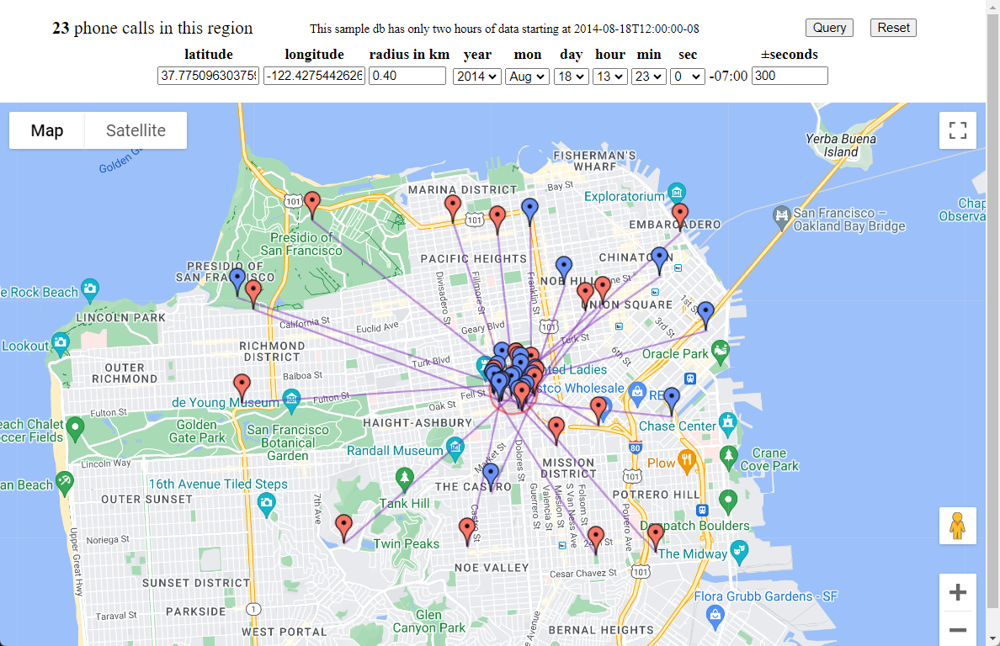

# Geodemo

## Introduction

AllegroGraph has a unique n-dimensional indexing capability that works
especially well with geotemporal data. By geotemporal we mean that we
use an index that uses x,y,t coordinates for cartesian
representations, or time,lat,lon for spherical representations. A
tutorial on how to use n-dimensional indexing can be found
[here](https://franz.com/agraph/support/documentation/current/geospatial-nd-tutorial.html#example-run-through). This
page describe a graph that contains phone call records of phone calls
made in the city of San Francisco. Every phone call has a
time/latitude/longitude of the caller and the callee. In the example
we use our n-dimensional indexing to index every record for the
(time,lat,lon) of the caller and the callee and
we show you how to use SPARQL to query the database.

The example on this github page
is an addition to this example. We show how
you can interact with this demo in Google Maps in your browser. This
is an example of what it might look like (depending on where you
click on the map):




Note that this picture shows you lines between callers and
callees. The circle is determined by the radians widget in the page
and contains all the phone calls that start or terminate in that circle.

We have a demo version running on [https://flux.franz.com:10027](https://flux.franz.com:10027). Just
click around play with the input boxes to see how fast the indexing
works.


## Running the demo locally

You will need to obtain a Google Maps API Key in order to run this demo.
The instructions from Google itself to obtain such a key is

> Go to the Google Maps Platform > Credentials page.
> On the Credentials page, click Create credentials > API key.
> The API key created dialog displays your newly created API key.


In case you want to play with this example yourself, you'll
find the following two files in this github project.

### File 1. geodemo.cl

If you only want to run the demo and not create new triples, then this
is the file that you need to compile in order to run the demo in Google
Maps. Make sure you have access to a running AllegroGraph server and
an Allegro Common Lisp compiler on the same server.

Before can compile it you have to edit the file in a few places

- edit the agraph.fasl location
- edit the port that on which AllegroGraph is running
- edit the port on which you are going to run the Maps demo.
- edit the line where the Google Maps API key is specified

Start up your lisp and `cd` to the location where you have your files

Compile and load the file

```
cl-user(3): :cl geodemo
```

Start the demo

```
cl-user(4): (start-demo)
```

Assuming you chose to view the demo on port 10027,
open your browser and go to    `http://localhost:10027`

### File 2: PhoneCalls.ttl

This file contains the prebuilt phone call records for your
convenience.  It is a set of triples written in Turtle format.

Have fun with the demo!


## Generate your own phone calls

Lispers might want to create their own nd triple stores. The file
generate-phonecalls.cl shows how the triples in the PhoneCalls demo
were generated. It also provides some prolog and sparql queries. 

Here are the steps to create your own triples..

1. Change the `require` expression to point the right version of the `agraph.fasl` in the `lib` directory where AllegroGraph is installed. 
2. Change `.test-port`. to the port on which your your AllegroGraph server runs.
3. In your ACL compile and load the file `generate-phonecalls.cl`
4. Run `(db.agraph.user::create-store :name "SomeName" :num 1000000)`

`:name` is the name of the repository to create

`:num` is the number of phonecalls you wat to generate.


