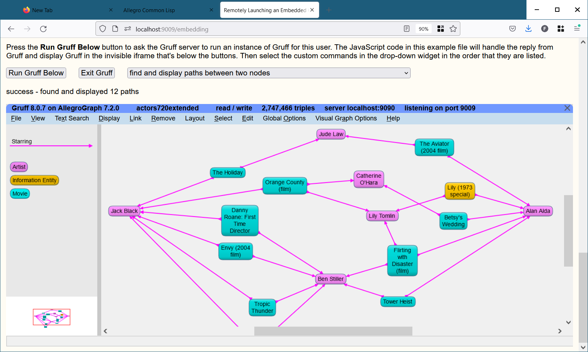

### Embedding Gruff In a Web Page

Gruff can be embedded in any web page to let readers use Gruff on
your web site.  The file [embedding.html](embedding.html) in the Gruff
installation folder explains how to set up a running example of this.
That file also serves as the example web page itself.  You can adapt
its JavaScript code for use on your own web site.

Gruff needs to be running in a special "launcher" mode on a server
machine that the web browser can reach.  Then your web page can send a
message to the Gruff server that tells it to launch another instance
of Gruff for the reader to use in one area of your page.

Simply embedding Gruff allows the reader to use Gruff by itself as
usual inside the web page.  A more advanced feature is that your web
application can also send custom commands to Gruff.  For example, your
application could derive a set of triples that it wants Gruff to
display, and then send those triples to Gruff.

See [embedding.html](embedding.html) for the actual example file that
you can find in your Gruff installation folder.  Note that its "Run
Gruff Below" button will not work here, because the Gruff server is
not running.

This example requires Gruff 8.1.0 to fully work as described here.

Below are a couple of images of the example web page as it appears in
a browser after Gruff has been embedded in an iframe below the
instructions.  The drop-down widget above Gruff contains custom
commands that the web page sends to Gruff.

