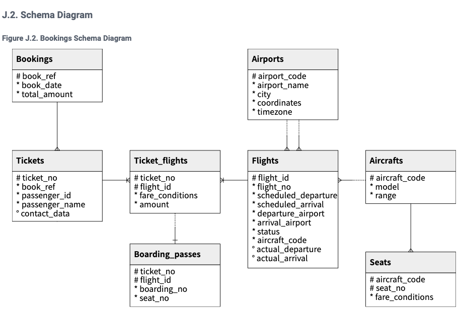
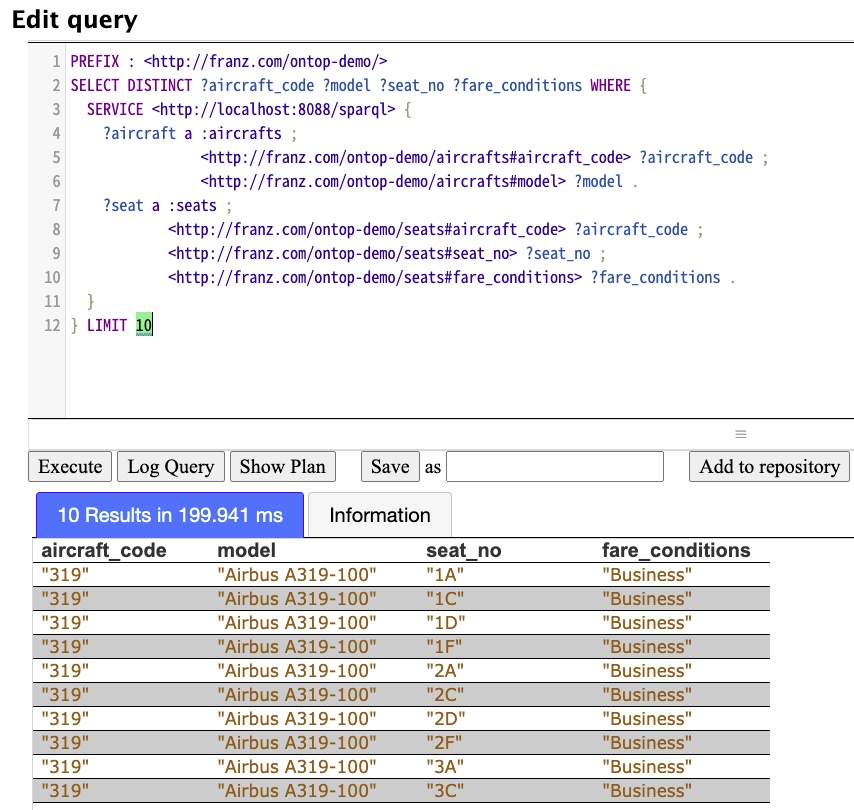

# Creating Virtual and Materialized Graphs in AllegroGraph

## 1. Introduction

*Virtual knowledge graph* (VKG) is a trending paradigm for data integration and access. It is also known in the literature as *Ontology-based Data Access*. Typically, such VKG systems expose the content of arbitrary relational databases or data warehouses as knowledge graphs. The exposed graphs are **virtual**, which means all data remains in the data sources.

[Ontop](https://ontop-vkg.org/) is a Virtual Knowledge Graph system. In this tutorial, we will show:

* the basics of using Ontop
* how to start a SPARQL endpoint for your vkg
* how to import all data to AllegroGraph (materialisation)

## 2. Getting started

We have prepared a workspace for this tutorial. The directory structure looks like this:

```
$ tree -IF img
.
├── bin/
│   ├── demo.mini-mapping.obda
│   ├── demo.properties
│   └── init-db.sh
├── Dockerfile.bootstrap
├── Dockerfile.endpoint
├── Dockerfile.materialize
├── Dockerfile.pg
├── ontop_output/
└── README.md

2 directories, 8 files
```

To start playing, all you need to have on your system is a [Docker Engine](https://docs.docker.com/engine/install/).

We are using this [database](https://postgrespro.com/education/demodb) for our demonstration. Here is its schema diagram:



### 2.1 Start up Postgresql and AllegroGraph

Firstly, let's build our demo Postgresql database image[^1]:

```
docker build -t demo_pg -f Dockerfile.pg $(pwd)
```

Once your image has been built, it's time to fire up[^2] [Postgresql](https://www.postgresql.org/)

```
docker run --rm -d --name demo_pg --env POSTGRES_USER=test --env POSTGRES_PASSWORD=xyzzy --env POSTGRES_DB=demo --network host demo_pg
```

and [AllegroGraph](https://allegrograph.com/) also:

```
docker run --rm -d --name demo_ag --shm-size=2g --env AGRAPH_SUPER_USER=test --env AGRAPH_SUPER_PASSWORD=xyzzy --network host franzinc/agraph
```

By default:

* *Postgresql v13* is running at port 5432
* *AllegroGraph v7.1.0* is running at <http://localhost:10035>
* both has login:
  * user: test
  * password: xyzzy

Please note that, you will need to keep those databases running but in the end of this tutorial, do remember to stop them by: `docker stop demo_pg -t 0 && docker stop demo_ag -t 0`

## 3. Essentials of Ontop

There are several key concepts of Ontop. For users, it is necessary to have a clear understanding before we go further.

### 3.1 Ontologies and Mappings

**Ontologies** represent a specification of conceptualization of your domain knowledge. Although it is an **optional** input for Ontop, ontologies are very useful for enriching your knowledge graph by, for instance, taking account of class hierarchies.

Ontop supports lightweight ontologies expressed in RDFS or in the slightly more expressive OWL 2 QL fragment of OWL.

**Mappings** specify the correspondence between the data models of the relational data sources and the RDF graph. In the Semantic Web community, [R2RML](https://www.w3.org/TR/r2rml/) was created as a standard for mapping. However, Ontop has its own mapping language *OBDA*, and it is fully compatible with *R2RML*[^3].

### 3.2 Bootstrap your Ontologies and Mappings

Depending on the complexity of your domain, programming ontologies and mappings from scratch may be rather time-consuming. Ontop provides a [bootstrap](https://ontop-vkg.org/guide/cli.html#ontop-bootstrap) API to partially solve this problem. This API allows the **automatic generation** of mappings and ontologies by reading from a database schema information solely.

To start, let's build the demo_bootstrap image first:

```
docker build -t demo_bootstrap -f Dockerfile.bootstrap $(pwd)
```

Then we run the container by:

```
docker run --rm --mount "type=bind,src=$(pwd)/ontop_output,dst=/var/ontop" --network host demo_bootstrap
```

Now you should see two new files in ontop_output folder:

```
ontop_output
├── demo.mapping.obda
└── demo.ontology.ttl

0 directories, 2 files
```

#### 3.2.1 Overview of the mapping file

We have not shown any piece of the mapping file so far. In this section, we will very briefly explain its syntax so that you may have a better overall conception.

From line 9 to 11 of demo.mapping.obda:

```
mappingId MAPPING-ID1

target      <http://franz.com/ontop-demo/ticket_flights/ticket_no={ticket_no};flight_id={flight_id}> a <http://franz.com/ontop-demo/ticket_flights> ;
<http://franz.com/ontop-demo/ticket_flights#ticket_no> {ticket_no}^^xsd:string ;
<http://franz.com/ontop-demo/ticket_flights#flight_id> {flight_id}^^xsd:integer ;
<http://franz.com/ontop-demo/ticket_flights#fare_conditions> {fare_conditions}^^xsd:string ;
<http://franz.com/ontop-demo/ticket_flights#amount> {amount}^^xsd:decimal .

source SELECT * FROM "ticket_flights"
```

Explanations:

* The **mappingId** part assigns an identifier to the mapping
* The **target** part is described using a Turtle-like syntax, it is like a template for telling Ontop how you want to construct RDF triples
* The **source** part is a regular SQL query for telling Ontop how to query

To see more technical details of mappings, please see [here](https://ontop-vkg.org/tutorial/mapping/).

We will apply those 2 files soon. As mentioned, bootstrap is not the ultimate solution, the domain experts may want to or even have to improve these for better VKG display. But right now, we will directly use them for rapid VKG experiments.

## 4. Start a SPARQL Endpoint

A SPARQL endpoint is one of the best choices for the frontend of your VKG. Ontop enables it by its [endpoint](https://ontop-vkg.org/guide/cli.html#ontop-endpoint) API. Again, let's start by building the image first:

```
docker build -t demo_endpoint -f Dockerfile.endpoint $(pwd)
```

To start the endpoint, run:

```
docker run -d --rm --name demo_endpoint --mount "type=bind,src=$(pwd)/ontop_output,dst=/var/ontop" --network host demo_endpoint
```

The endpoint will start a server at <http://localhost:8088/sparql> now. We can try a few queries:

* Models of aircraft

Query by curl:

```
curl -X POST --url http://localhost:8088/sparql \
     --header 'accept: text/csv' \
     --header 'content-type: application/sparql-query' \
     --data "SELECT DISTINCT ?aircraft ?model WHERE { ?aircraft a <http://franz.com/ontop-demo/aircrafts> ; <http://franz.com/ontop-demo/aircrafts#model> ?model }"
```

Query results:

```csv
aircraft,model
_:8855805534715252c1fe1bcb30cf270bdfb3ee8e,Airbus A319-100
_:48c7928f9dfc158532bfce05a87b4bffae241f62,Airbus A320-200
_:bb6056539c4f6a9500ae51e7c6985962665ad3fd,Airbus A321-200
_:f64b03bbafc13bd35af35412174b4ef0eab0b6dc,Boeing 737-300
_:4c7bbc5a6c315550263e266905f1efb104e36b2f,Boeing 767-300
_:d7744907e72350b03146d7990851478c119b6a1a,Boeing 777-300
_:616456058f0195cbcc5971903e98aaf3b5e463f4,Cessna 208 Caravan
_:42c2ef92f630f5f1eb55b5987e2ba00ec92c334d,Bombardier CRJ-200
_:78d22cd9ac8bb4c690577f3bee66d25e7d455991,Sukhoi Superjet-100
```

* Seat information of aircraft "Boeing 737-300" (in AllegroGraph, by federated
  query)

```sparql
PREFIX : <http://franz.com/ontop-demo/>
SELECT DISTINCT ?aircraft_code ?seat_no ?fare_conditions WHERE {
  SERVICE <http://localhost:8088/sparql> {
    ?aircraft a :aircrafts;
                <http://franz.com/ontop-demo/aircrafts#aircraft_code> ?aircraft_code;
                <http://franz.com/ontop-demo/aircrafts#model> "Boeing 777-300" .
    ?seat a :seats;
            <http://franz.com/ontop-demo/seats#aircraft_code> ?aircraft_code;
            <http://franz.com/ontop-demo/seats#seat_no> ?seat_no;
            <http://franz.com/ontop-demo/seats#fare_conditions> ?fare_conditions .
  }
} LIMIT 10
```

Query results:



To stop the endpoint, run:

```
docker stop demo_endpoint -t 0
```

## 5. Materialisation

Last but not least, Ontop provides a handy API [materialize](https://ontop-vkg.org/guide/cli.html#ontop-materialize) for importing triples directly from your database(s). By feeding the (optional) ontologies and mappings, Ontop will dump all triples in a single output file.

Usually, materialisation will take a relatively longer time. For simplicity, we have prepared a mapping file demo.mini-mapping.obda that has only 2 mappings. You may find it in the bin folder, and this is what we will use in this section.

Build the demo_materialize image:

```
docker build -t demo_materialize -f Dockerfile.materialize $(pwd)
```

Then run the container by:

```
docker run --rm --name demo_materialize --mount "type=bind,src=$(pwd)/ontop_output,dst=/var/ontop" --network host demo_materialize
```

Now you should see a demo.materialized.nt file in ontop_output directory, and you can now import it into AllegroGraph through [agtool](https://franz.com/agraph/support/documentation/current/agtool.html) or many other ways.

## 6. Conclusions

In this tutorial, we have demonstrated how to use Ontop for virtualising your knowledge graph, including Ontop's key concepts like ontologies and mapping, and various APIs it provides. However, it is difficult to cover everything up, there are many technical details behind the scenes. You may continue by browsing Ontop's [guides](https://ontop-vkg.org/guide/) and [tutorials](https://ontop-vkg.org/tutorial/), and look into our Dockerfiles for further information.

We have summarised a general workflow:

1. Prepare your database's access[^4]
2. Use Ontop's bootstrap to automatically generate the ontology and the mapping file; validate and refine further (by domain experts) if necessary
3. Select one or both approach(s) for distributing your VKG:
   * Use Ontop's endpoint API to host the virtual graph(s) as a service; AllegroGraph can later integrate with it through many ways, e.g SPARQL federated queries
   * Use Ontop's materialize to export RDF triples from the database(s), and then import into AllegroGraph
4. Design and develop upper-layer ELTs or applications

---
[^1]: By default, we are loading the *small* version of the database, and there are also medium and big versions. You may change this behavior by using \--build-arg. For example: `docker build -t demo_pg -f Dockerfile.db \--build-arg demo_size=big .`

[^2]: Postgresql needs some time to create the database. You can see its status by `docker logs -f demo_pg`. This initialisation should finish in 1 or 2 minutes.

[^3]: Ontop provides an API to translate between OBDA and R2RML, see [here](https://ontop-vkg.org/guide/cli.html#ontop-mapping).

[^4]: It would be great if it's integrated with Spark, as Ontop fully relies on a JDBC driver's parallelism
