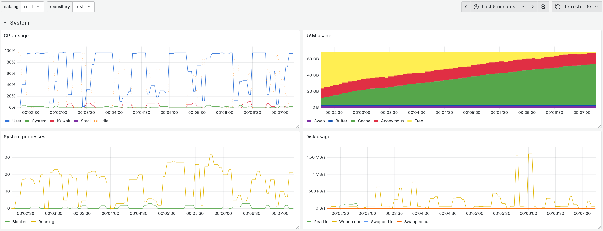
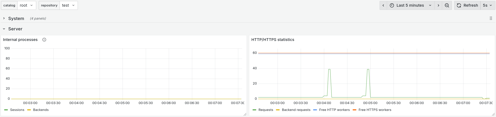
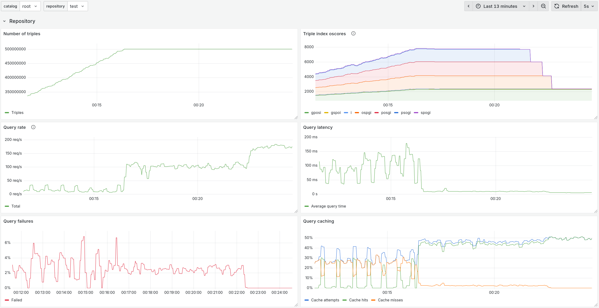

# Monitoring AllegroGraph with Prometheus and Grafana

This is an example of using the new `/metrics` endpoint introduced in
AllegroGraph v8.5.0.

The file `agraph.yml` is the Prometheus configuration that scrapes
metrics in all supported categories.

The file `agraph.json` is a JSON model of a Grafana dashboard that
showcases all these metrics. This model can be directly imported into
Grafana.

Please note that this example makes certain assumptions about the
AllegroGraph server. In particular, the user with `test:xyzzy`
credentials is expected to be a superuser.

Below are a couple of screenshots of the demo Grafana dashboard:

