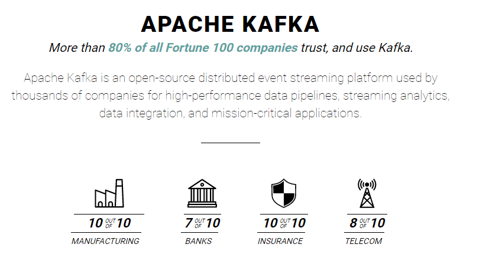
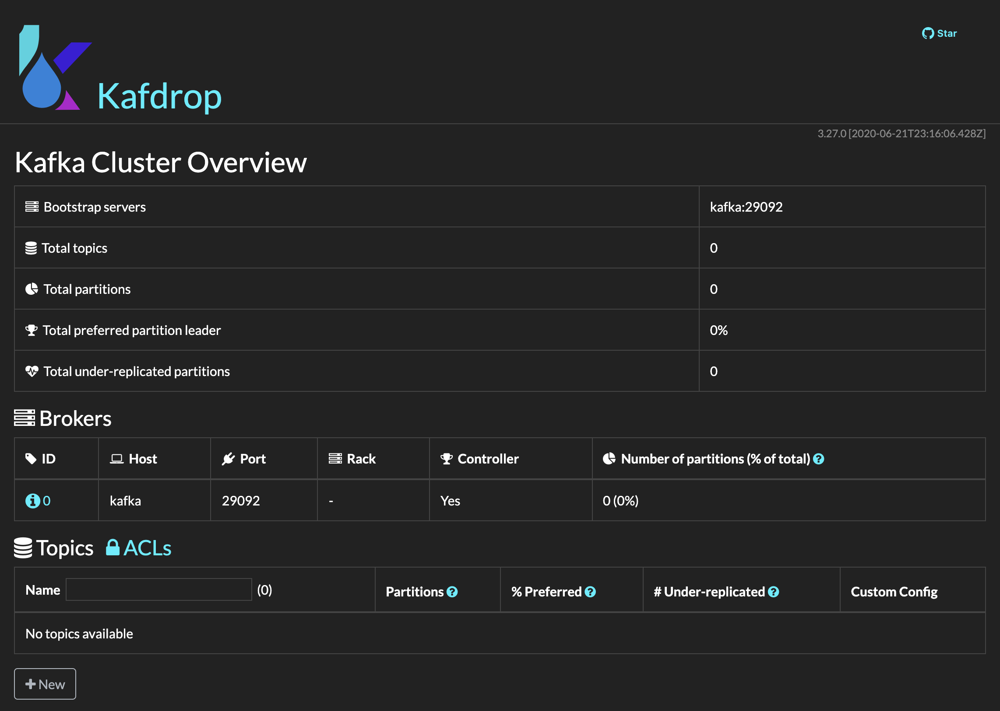
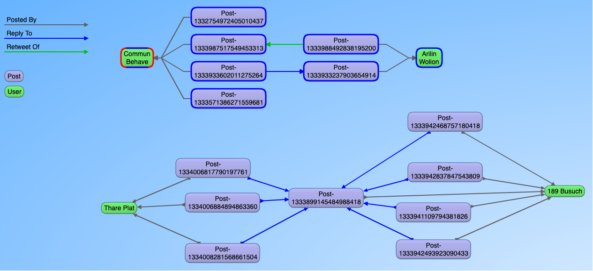
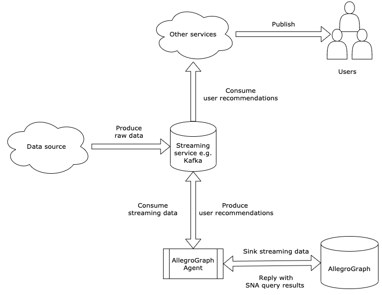
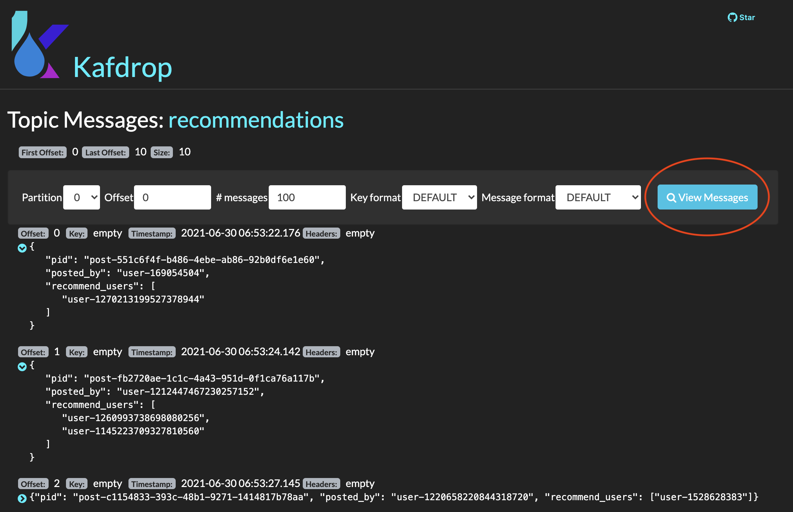

# Construct a Graph Streaming Pipeline by Using Kafka and AllegroGraph

## 1. Introduction

Nowadays, enterprises are starting to adopt streaming pipelines to provide insights that adapt to new data in **real-time**. This goes beyond traditional approaches that operate on data **batches**. Compared to batch processing, the advantage of streaming is obvious. For example, in the manufacturing area, analyzing data from various sensors in real-time allows a manufacturer to spot problems and correct them before a product leaves the production line. This improves the efficiency of operations — and saves money. When "real-time experience" is important (or mandatory), a flexible, scalable and robust streaming platform is always more suitable.

AllegroGraph is used very often as an Entity Event Knowledge Graph platform. Our customers use the entity-event approach in diverse settings like a call center, a hospital, in insurance, in aviation and even in finance. AllegroGraph as an entity-event knowledge graph will accept incoming events, do instant queries and analytics on the new data and then store events and results. AllegroGraph is geared to high speed inserts so in general can keep up with high business loads but for several reasons it is advantageous to couple AllegroGraph with Apache Kafka. Apache Kafka is an open-source distributed event streaming platform used by thousands of companies for high-performance data pipelines, streaming analytics, data integration, and mission-critical applications.



In this tutorial, we will show an end-to-end example of constructing a graph streaming pipeline by using [Apache Kafka](https://kafka.apache.org/) and AllegroGraph.

## 2. Getting Started

We have packaged all the resources and source code for this tutorial. To start, you need to have these two tools installed:

1. a Docker Engine, e.g. [https://docs.docker.com/engine/install/](https://docs.docker.com/engine/install/), and [https://podman.io/](https://podman.io/)
2. [Docker Compose](https://docs.docker.com/compose/), or [podman-compose](https://github.com/containers/podman-compose) if you are using [Podman](https://podman.io/)

### 2.1 Start the Kafka Cluster

[Apache Kafka](https://kafka.apache.org/) is a high-throughput, low-latency platform for handling real-time data feeds. We are using Kafka for demonstrating data streaming only. Technically, you can replace it with any other similar platform like [Amazon Kinesis](https://aws.amazon.com/kinesis/). Which platform to choose, or how to deploy and manage such a platform is beyond the scope of this tutorial.

Before we proceed, there are a few basic terms of Kafka that you need to know:

1. Broker - a Kafka instance running in a Kafka cluster
2. Topic - a category/feed/channel name to which data are stored and published
3. Producer - the one who produces data to a topic
4. Consumer - the one who consumes data from a topic

Firstly, please clone our [repository](https://github.com/franzinc/agraph-examples) by `git clone https://github.com/franzinc/agraph-examples.git` and then change the directory to **"streaming/kafka/"**.
Now, issue the command `make kafka` to start a single-node Kafka cluster, or issue `make kafka DOCKER_COMPOSE=podman-compose` if you are using `podman-compose`. Additionally, there is also a Kafka Web UI (powered by [kafdrop](https://github.com/obsidiandynamics/kafdrop)) running at port `9000` on your host. If the cluster has successfully started, you should see this page by visiting [http://localhost:9000](http://localhost:9000); as the page says, there's only one Kafka broker running at port `9092`:



## 3. A Use Case in Social Media

Social media is a great example of demonstrating graph streaming. Every second, on average, there are thousands of tweets posted by users who are following and followed by other users, and each tweet post may be a **retweet** or a **reply** to another tweet(s). Analogously, we have created a simplified data model for our tutorial:

* a *Post* is a class where each instance has a unique `ID`, `content` and other metadata
* a *User* is a class where each instance has a unique `ID`, `name` and other metadata
* a *Post* is **posted by** a *User*
* a *Post* may be a **retweet of** another *Post*
* a *Post* may be a **reply to** another *Post*



In our use case, every 1 to 3 seconds, a new post will be produced to a Kafka topic named `posts`. Meanwhile, for the simplicity purpose, we assume that **no** new users will ever be created during the streaming.

Here is an example (JSON) data of a post:

```json
{
   "pid":"post-22898f25-5d11-4ce7-ad1c-502ba1b67211",
   "content":"Predominant force (21,000 km2) of which is Latin America's leading film producer, a",
   "posted_by":"user-1241306505653006336",
   "retweet_of":"post-1333737853843607554",
   "reply_to":null
}
```

Now, for each new post, we want to:

1. sink the post (as triples) into AllegroGraph
2. ask AllegroGraph to recommend "friends" (similar users) for the post's author
3. produce the recommendations to a Kafka topic named `recommendations` so that other consumers can subscribe to it

We will employ an *AllegroGraph Agent* to achieve those goals. Our agent will transform the JSON data into RDF triples and add them to AllegroGraph. In the next step, the agent will do a SPARQL query to retrieve similar users from the **whole graph** and finally, produce the recommendations to the `recommendations` Kafka topic. There are many ways to define and query "similar users" in a graph. In this tutorial, we are using AllegroGraph's [Social Network Analysis](https://franz.com/agraph/support/documentation/current/magic-properties.html#sparql-magic-sna) feature. See [here](https://franz.com/agraph/support/documentation/current/magic-properties.html#Groups-and-Centrality-Measures) for more technical details.

Put everything together, we have prepared a diagram for illustrating our graph streaming pipeline:



## 4. Demonstration

### 4.1 AllegroGraph

Issue the command `make ag` to start an AllegroGraph instance at port `10055`, with username `test` and password `xyzzy`. It will create a repository named `kafka-basic` and load some initialization triples into it so that other services can start from there.

```
$ make ag
... output from docker omitted ...
2021-06-30 06:31:45,658 - streaming.init_repo - INFO - AllegroGraph repo 'kafka-basic' connected
2021-06-30 06:31:54,859 - streaming.init_repo - INFO - Triples added to the repo
2021-06-30 06:31:55,046 - streaming.init_repo - INFO - SNA clauses successfully added
2021-06-30 06:31:55,192 - streaming.init_repo - INFO - Repo is ready at http://localhost:10055/#/repositories/kafka-basic
```

If the command runs successfully, the repository will be ready at [http://localhost:10055/#/repositories/kafka-basic](http://localhost:10055/#/repositories/kafka-basic).

### 4.2 Posts Producer

Issue the command `make producer` to start producing posts to the Kafka topic `posts`. It is a program that will keep producing posts every 1 to 3 seconds. By default, after **10,000** posts, the producer will exit. You can increase the number by using the `NUM_POSTS` variable, for example, `make producer NUM_POSTS=20000`.

If you are interested, you can view the logs of our producer by `docker logs -f ag-kafka-basic_producer`:

```
$ docker logs -f ag-kafka-basic_producer
2021-06-30 06:50:54,867 - streaming.producer - INFO - Message delivered to topic <posts>
2021-06-30 06:50:55,868 - streaming.producer - INFO - Message delivered to topic <posts>
2021-06-30 06:50:56,870 - streaming.producer - INFO - Message delivered to topic <posts>
... more lines omitted ...
```

You can also view the posts data in the web UI. Go to [http://localhost:9000/topic/posts/messages](http://localhost:9000/topic/posts/messages) and click on `View Messages`:


### 4.3 AllegroGraph Agent

Finally, to start our agent, issue `make agent`. Recall that this service will consume from the `posts` topic and produce to the `recommendations` topic at the same time. Let's take a look at the logs by `docker logs -f ag-kafka-basic_agent`:

```
$ docker logs -f ag-kafka-basic_agent
2021-06-30 06:53:12,141 - streaming.agent - INFO - AllegroGraph connected. ADD_COMMIT_SIZE: 1000
2021-06-30 06:53:12,145 - streaming.agent - INFO - Topic <posts> subscribed.
2021-06-30 06:53:16,066 - streaming.agent - INFO - Message of <post-f28be70f-1e74-4e6b-9245-010c6aefb23d> consumed.
2021-06-30 06:53:16,132 - streaming.agent - INFO - NTriples data added for <post-f28be70f-1e74-4e6b-9245-010c6aefb23d>. Repo size: 187883.
2021-06-30 06:53:19,069 - streaming.agent - INFO - Message of <post-a1e11e22-ccd2-45ed-b5a6-c4dc3e6fd7a5> consumed.
2021-06-30 06:53:19,082 - streaming.agent - INFO - NTriples data added for <post-a1e11e22-ccd2-45ed-b5a6-c4dc3e6fd7a5>. Repo size: 187886.
2021-06-30 06:53:20,071 - streaming.agent - INFO - Message of <post-84fc8972-e3ab-48ce-9182-30da72b6a9fc> consumed.
2021-06-30 06:53:20,084 - streaming.agent - INFO - NTriples data added for <post-84fc8972-e3ab-48ce-9182-30da72b6a9fc>. Repo size: 187889.
2021-06-30 06:53:21,072 - streaming.agent - INFO - Message of <post-7ef31eae-d5c2-46d0-83d5-14ea552cf768> consumed.
2021-06-30 06:53:21,084 - streaming.agent - INFO - NTriples data added for <post-7ef31eae-d5c2-46d0-83d5-14ea552cf768>. Repo size: 187892.
2021-06-30 06:53:22,075 - streaming.agent - INFO - Message of <post-551c6f4f-b486-4ebe-ab86-92b0df6e1e60> consumed.
2021-06-30 06:53:22,087 - streaming.agent - INFO - NTriples data added for <post-551c6f4f-b486-4ebe-ab86-92b0df6e1e60>. Repo size: 187896.
2021-06-30 06:53:22,176 - streaming.agent - INFO - User recommendations of <post-551c6f4f-b486-4ebe-ab86-92b0df6e1e60> have been sent to topic <recommendations>
2021-06-30 06:53:24,077 - streaming.agent - INFO - Message of <post-fb2720ae-1c1c-4a43-951d-0f1ca76a117b> consumed.
2021-06-30 06:53:24,091 - streaming.agent - INFO - NTriples data added for <post-fb2720ae-1c1c-4a43-951d-0f1ca76a117b>. Repo size: 187900.
2021-06-30 06:53:24,142 - streaming.agent - INFO - User recommendations of <post-fb2720ae-1c1c-4a43-951d-0f1ca76a117b> have been sent to topic <recommendations>
2021-06-30 06:53:26,079 - streaming.agent - INFO - Message of <post-4470a3e7-c34c-45f8-8ffb-2571d07881e6> consumed.
2021-06-30 06:53:26,094 - streaming.agent - INFO - NTriples data added for <post-4470a3e7-c34c-45f8-8ffb-2571d07881e6>. Repo size: 187903.
... more lines omitted ...
```

Similarly, you can also see the recommendations data in the web UI: [http://localhost:9000/topic/recommendations/messages]. Not every new post will have a recommendation, so you probably need to wait a few seconds and click on `View Messages` multiple times to see updates:



At this stage, we have fired up a few docker containers. If you are about to finish this tutorial, we would like to remind you to stop all those services by `make stop`, or `make stop DOCKER_COMPOSE=podman-compose` if you are using `podman-compose`.

## 5. Conclusions

In this tutorial, we have demonstrated how to construct a graph streaming pipeline by using Kafka and AllegroGraph in the context of social media analytics. AllegroGraph is responsible for consuming data from a Kafka topic, performing social network analytics and then producing the results to another Kafka topic so that downstream services can consume from it. In general, any programming language that has a Kafka driver and an AllegroGraph client library can be used to implement our *AllegroGraph Agent*. We have used Python for this tutorial. Please visit the `streaming` folder, and especially [producer.py](streaming/producer.py) and [agent.py](streaming/agent.py) files for more technical details.

We have also shown a system diagram for our pipeline. We have made it very typical and general so that it can be easily adapted to any other use case. Streaming data and analytics infrastructure is a trending topic in many areas, and we look forward to exploring more potentials from AllegroGraph in it.
